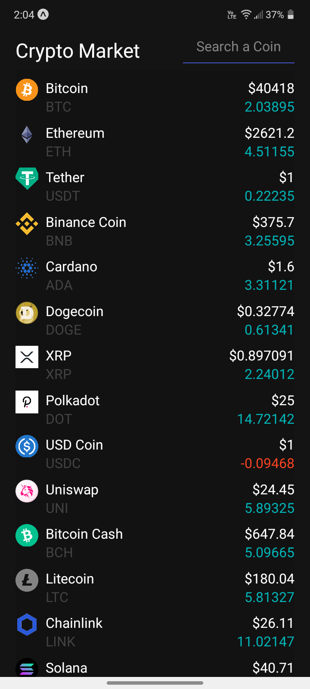
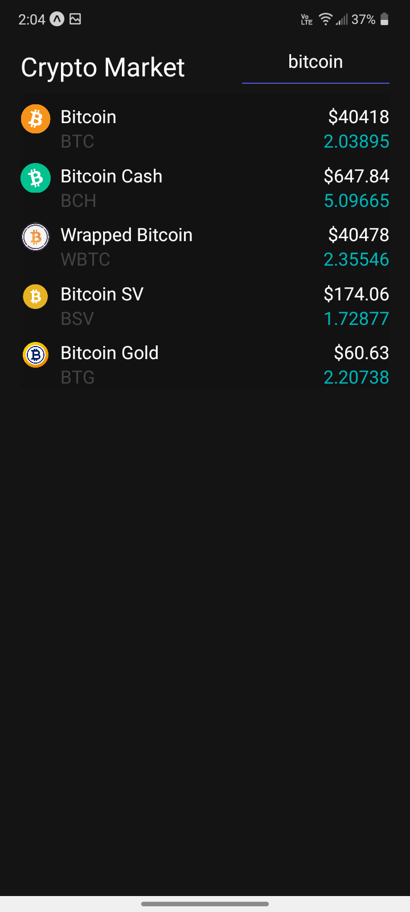
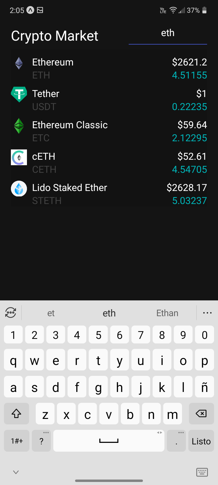

# React Native CryptoCurrency App

Cryptocurrency App to track the coins data in realtime for android & iOS, using Expo CLI and the CoinGecko API 

- [Expo CLI](https://expo.io/tools#cli "Expo.io")
- [React Native](https://reactnative.dev/)
- [CoinGecko API](https://www.coingecko.com/es/api)

Android screenshots
---------------





Getting Started
---------------

```sh
# clone it
git clone https://github.com/Saul-NH/react-native-crypto-app.git

cd react-native-crypto-app

# Install Expo CLI
npm install expo-cli --global

# Install dependencies
npm install
```

Run the project
---------------

```sh
# start the project
npm start

# for android
npm run android

# for ios
npm run ios

```


